# 
 Eco Commerce

## Features

- Sign-in through Google and Email supported
- Email sign-in backed up by Reset Password
- Beautiful onboarding layout and animations
- Shop by category and trending products
- Orders, Wishlist can be accessed in-app
- Edit account details easily
- Order products through quote based system
- Easily editable product widgets (Cards, Slider, Grids, Lists and more!)
- Beautiful Product pages with reviews, description and features
- Search products with filters, tags, price
- Optimized storage using minimal packages
- Application size under 11 MB
- Adaptive UI (changes color based on wallpaper)

## Demo

**Screens**

| 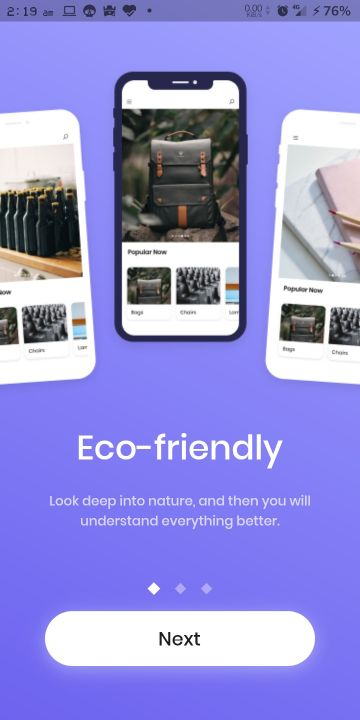 |  | 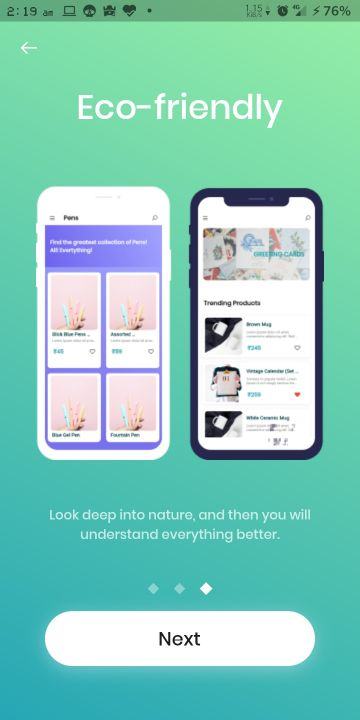 |
| :-------------:  | :-------------:  | :-------------:  |
|    Onboarding 1    |    Onboarding 2     |     Onboarding 3      |

|  |  |  |  |
| :-------------:  | :-------------:  | :-------------:  | :-------------:  |
|    Onboarding Sign in    |    New Sign up     |     New Sign up Wrong Password      |     New Sign up Correct Password     |

|  |  |  | 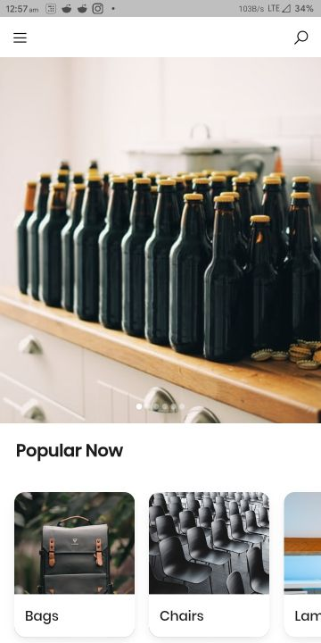 | 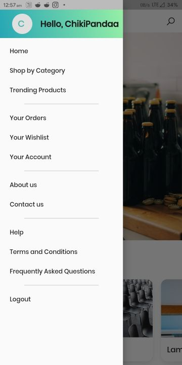 |
| :-------------: | :-------------:  | :-------------:  | :-------------:  | :-------------:  |
|     New Sign up Details     |    More info    |    More info filled    |     Home       |     Main Drawer     |

| 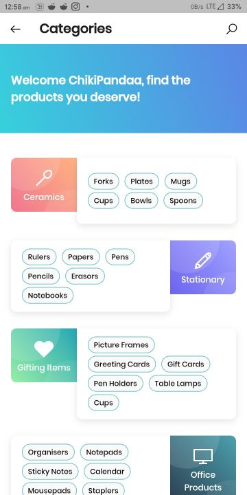 |  | 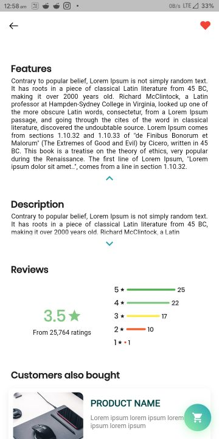 | 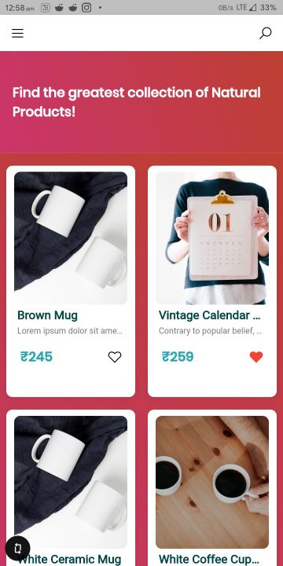 | 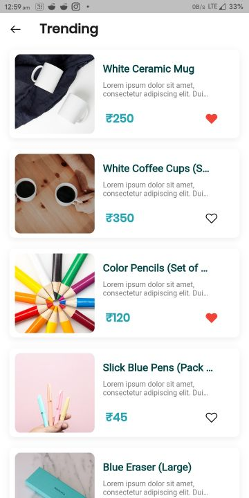 |
| :-------------: | :-------------:  | :-------------:  | :-------------:  | :-------------:  |
|     Categories    |    Product Page    |    Product Page 2     |     Grid Layout       |     Trending Products     |

| 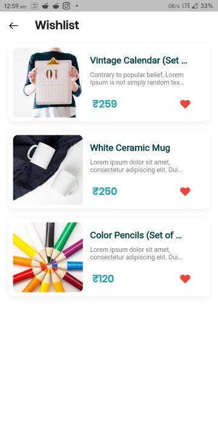 | 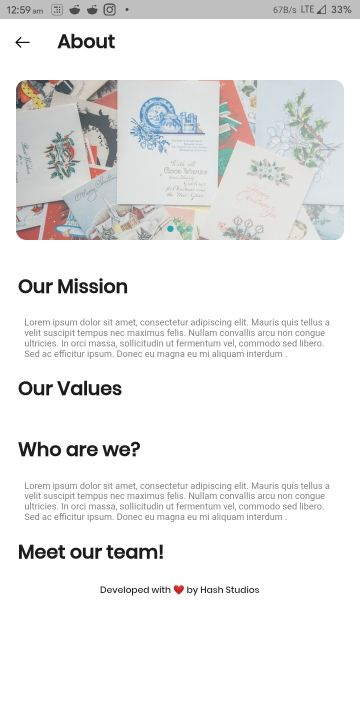 |  | 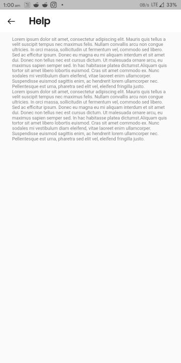 | 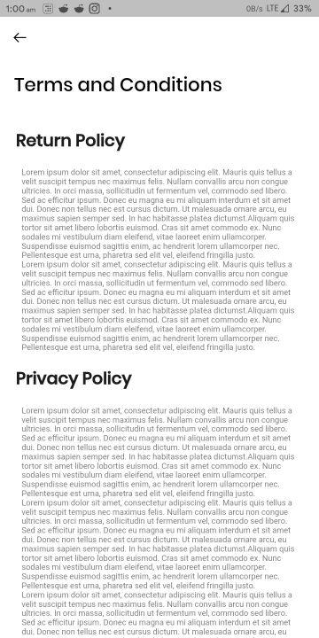 |
| :-------------: | :-------------:  | :-------------:  | :-------------:  | :-------------:  |
|     Wishlist     |    About Page    |     Contact Us       |     Help    |     Terms and conditions    |

| 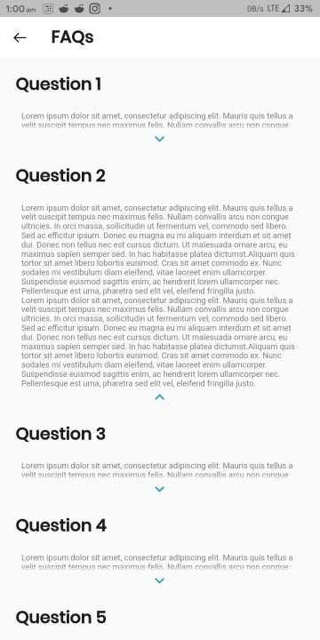 | 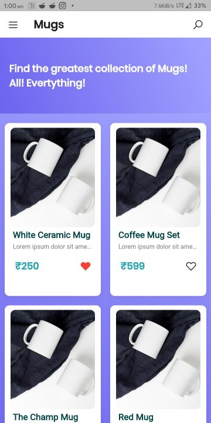| 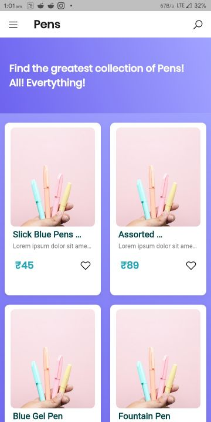       | 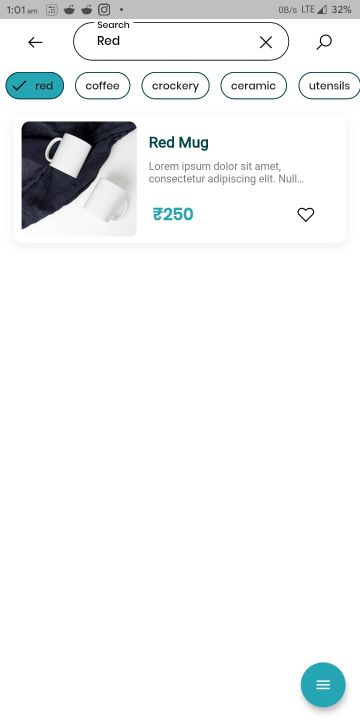  | 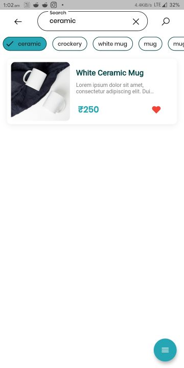|
| :-------------:  | :-------------: | :-------------:       | :-------------:  | :-------------: |
|  FAQs    |    Mugs       |  Pens    | Search 1   | Search 2  |

| 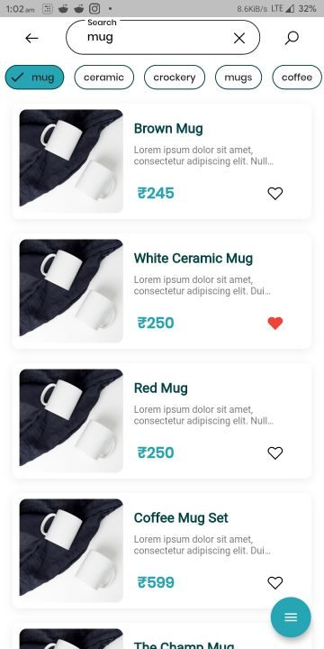 | 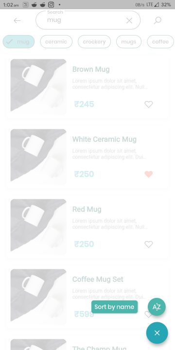 |  | 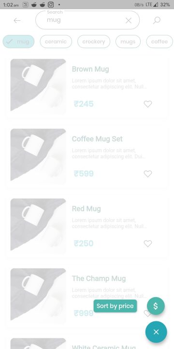 | 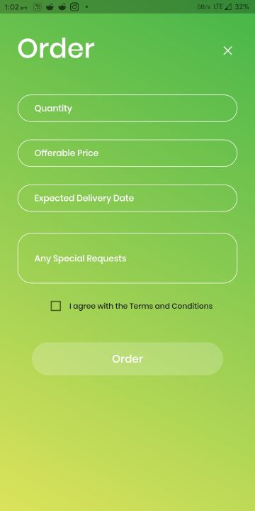 |
| :-------------: | :-------------:  | :-------------:  | :-------------:  | :-------------:  |
|     Search 3 (Price)    |    Sort by Name    |    Search 4 (Name)     |     Sort by Price       |     Order Form    |

| 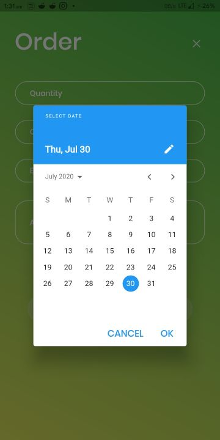 | 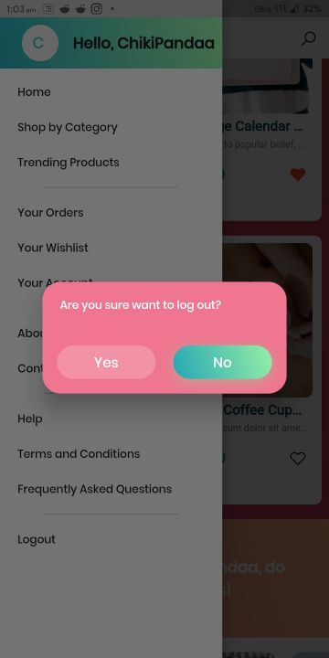| 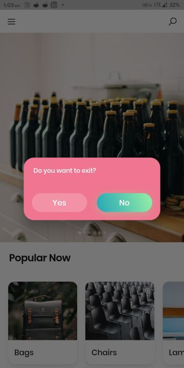|  | |
| :-------------:  | :-------------: | :-------------: | :-------------:  | :-------------: |
|  Date Entry  |Login PopUp|  Exit PopUp    |      Login    |      Reset Password  |

|  | | 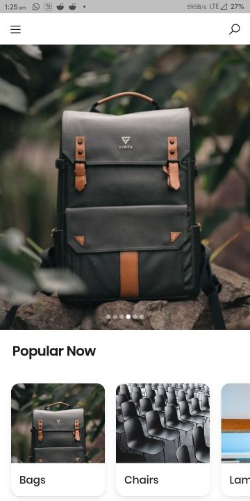|  | 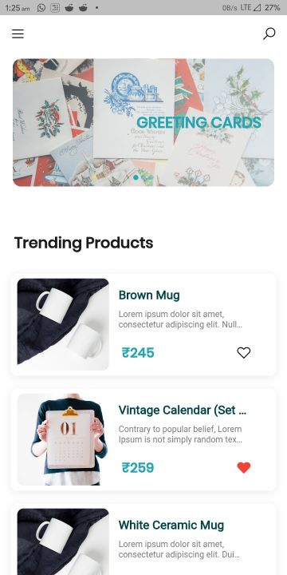|
| :-------------:  | :-------------: | :-------------: | :-------------:  | :-------------: |
|  Code Sent  |Incorrect Email|  Home 2    |      Home 3   |      Home 4  |

## Dependencies

The following packages are needed for the development of this application.

- `carousel_slider: ^2.1.0` for sliders
- `flutter_screenutil: ^1.1.0` for responsive UI
- `line_awesome_icons: ^1.0.4+2` for icons
- `http: ^0.12.1` for network requests
- `shared_preferences: ^0.5.7+3` for state management
- `fluttertoast: ^4.0.1` for toast notifications
- `visibility_detector: ^0.1.5` for widget visibility
- `mailer: ^3.0.4` for sending mails
- `pin_code_fields: ^3.1.2` for OTP pin fields
- `flutter_speed_dial: ^1.2.5` for FAB Speed Dial button
- `firebase_analytics: ^5.0.15` for analytics
- `firebase_core: ^0.4.5` for Firebase
- `cupertino_icons: ^0.1.3` for icons
- `firebase_auth: ^0.16.1` for Google Authentication
- `provider: ^4.1.3` for state management
- `google_sign_in: ^4.5.1` for Google Sign-in
- `expand_widget: ^0.2.0+2` for expanding widget

More details about these can be found in the [`pubspec.yaml`](https://github.com/Hash-Studios/eco_commerce_app/tree/master/pubspec.yaml) file.

